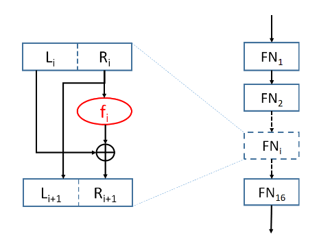
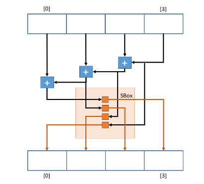

# Personal notes and TODOs

## Analysing the given assignment

### The important parts of the assignment

**Introduction**

* Implement a cipher with a DES resemblance,
* it uses solely Feistel Networks and S-Boxes
* We must use key-dependent S-Boxes. 
* E-DES will use longer, 256-bit keys.

**Homework**

* 256-bit key
* Input and Output blocks of 64 bits
* Function used in each Feistel Network should be implemented exclusively
by an S-Box
* More information about S-Boxes bellow
* Unlike DES, there is no initial and final bit permutations
* Example of an fi function
    

**S-Boxes** 
* All 16 S-Boxes should be different 
* They should be generated from the key
* the generation process should not allow to discover an S-Box from the value of any of the 15 other
* S-Boxes cannot be equal
* it should not be easy to discover the key from any subset of the S-Boxes
* The 16 S-Boxes should be deterministically computed only once
* Do not use language-dependent shuffling features
* 16 S-Boxes must have exactly 16 equal byte values, but these do not need to be equally distributed by all S-Boxes. 
* One may have 3 zeros and another 5 eights but in the totality the S-Boxes must have exactly 16 zeros and 16 eights

**Feistel Network**
* The values in each S-Box are the output for a byte-long input.
* Blocs of 64 so it will be 32 on each slice Li and Ri

* **Feistel Network Transformation**
    S-Boxes will be used to transform 4-byte values a byte at the time.
    
    The algorithm to implement is the following
    * The output byte in the lowest memory address (offset 0) should be the output of the S-Box for the input byte in the higher memory address (offset 3);
    * The output byte in the next memory address (offset 1) should be the output of the S-Box for an input with the sum modulo 256 of the two input bytes in the higher memory addresses (offsets 2 and 3);
    * The output byte in the next memory address (offset 2) should be the output of the S-Box for an input with the sum modulo 256 of the three input bytes in the higher memory addresses (offsets 1, 2 and 3);
    * The output byte in the highest memory address (offset 3) should be the output of the S-Box for an input with the sum modulo 256 of the four input bytes;

    

    ***S-Box Tranformation/Permutation Code Example***
    ```
    uint8_t SBox [256];
    uint8_t in [4];
    uint8_t out [4];
    uint8_t index = in [3];
    out [0] = sbox [ index ];
    index = ( index + in [2]) ;
    out [1] = sbox [ index ];
    index = ( index + in [1]) ;
    out [2] = sbox [ index ];
    index = ( index + in [0]) ;
    out [3] = sbox [ index ]
    ```

### Application and Delivery

This is for 2 Diferent Languges

1. **Implementing E-DES in a module or library**

2. **Decrypt and Encrypt Applications**

    * These aplications receive one textual password as argument, which will be used to generate the 256-bit key of E-DES. 
    * There must be an option available to default to the normal DES
    * Applications should process the input from stdin
    * produce a result to stdou
    * process the input in ECB mode
    * Use **PKCS#7** padding.

    Results show always be language independent, this is, we should be able to encrypt and decrypt with applications in different languages

3. **Speed Application**

    * Application to evaluate the relative performance of your E-DES implementation
    and one or more library implementation of DES

    * For that, allocate a 4KiB buffer (a memory page), fill it with random values (you can use /dev/urandom for that), and evaluate the time it takes to encrypt and decrypt the buffer with DES (from the library) and E-DES (both in ECB mode). Perform at least 100 000 measurements of each operation, and present the lowest values observed for each. For each measurement, use new, random keys

    * Use the Linux system call clock_gettime function, which provides a nanosecond precision, this may require a bash script.


## Done

* Learn how to implement substitution boxes and that sort of permutation
* Use that seed to generate the S Boxes
* Instead of using Pseudo random generator I could use multiple hashes as well:
    * Hash(key,1)
    * Hash(key,2)
    * Hash(key,3)
* Search a deterministic shuffling algorithm for the S-Boxes. 
    * Possibly Fisher-Yates
* Test S-Boxes with Least significant bit (LSB) that the professor gave us
* Generate a seed from the key with the a hash function.
* Padding
* Receive Input
* Encryption Tool 
* Decryption Tool

## TODO


* DES Mode in python
* Speed tool in both languages
